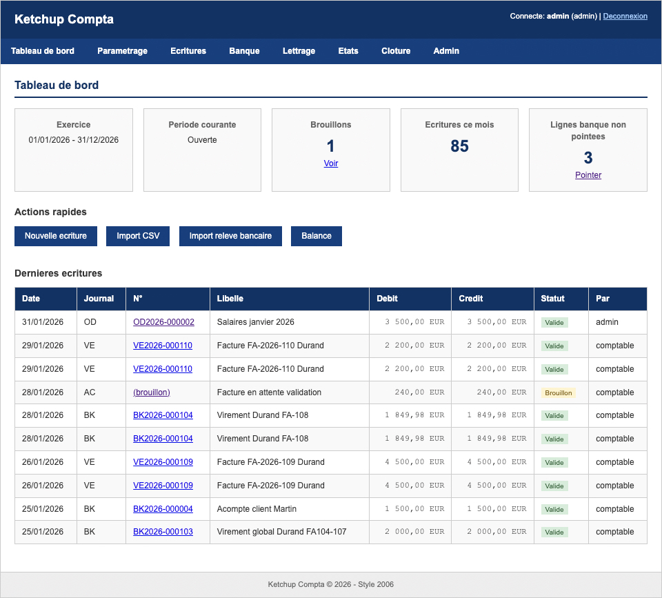

# Ketchup Compta

French accounting app built with 2006-era PHP patterns (intentionally legacy).




## Quick Start

```bash
docker-compose up -d
open http://localhost:8080
```

Logins:
| User | Password | Role |
|------|----------|------|
| `admin` | `admin123` | Administrator |
| `comptable` | `comptable123` | Accountant |
| `lecteur` | `lecteur123` | Viewer |

## Run Tests

```bash
bash tests/run_all_tests.sh
```

## Details

See `CLAUDE.md` for full documentation.
